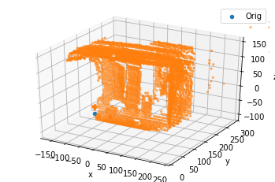
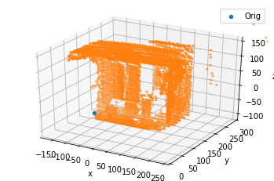
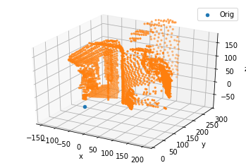

# Libreria para lectura y ploteo de DataSets


```python
import LibraryTT.txt2array as conversion
```

## Lectura de set de puntos desde un archivo *.txt
Se puede agregar la ruta del archivo txt como parametro, si no se cuenta con la ruta, y se deja la función sin argumentos, aparecerá una ventana para la busqueda del archivo a abrir

```python
#  Funcion sin ningun argumento (Se abrirá ventana para buscar el archivo)
from  numpy import shape
%matplotlib inline
a=conversion.txt2array()
print(f"Forma del vector nx3 ={shape(a)}")
conversion.imprimir3D(a)
```

    Forma del vector nx3 =(3155, 3)





```python
# Forma 2: Función con algun argumneto
%matplotlib inline
a=conversion.txt2array("./Sets/prueba_200911021124.txt")
conversion.imprimir3D(a)
```


## Lectura de set de puntos desde un archivo *.csv
La ventaja de manejar los archivos csv es que estos pueden ser manipulados en una hoja de calculo, en caso de ser necesario

De la misma forma, si la función de lecutra no tiene ningun argumento, se abrirá una ventana emergente para buscar el archivo *.csv que deseé abrir

```python
#Forma 1:   Funcion sin ningun argumento (Se abrirá ventana para buscar el archivo)
from  numpy import shape
%matplotlib inline
a=conversion.csv2array()
print(f"Forma del vector nx3 ={shape(a)}")
conversion.imprimir3D(a)
```

    Forma del vector nx3 =(3144, 3)





```python
# Forma 2: Función con algun argumneto
%matplotlib inline
a=conversion.csv2array("./Sets_CSV/prueba_200911015330.csv")
conversion.imprimir3D(a)
```


## Escritura de set de puntos desde un archivo *.txt
Los archivos se guardarán con la siguiente nomenclatura:
    prueba<año><mes><dia><hora><minutos><segundos>.txt
    Ejemplo: "prueba_200911190321.txt"

```python
import os
a=conversion.txt2array()
conversion.array2txt(a) #Escritura del nuevo vector nx3
file = os.listdir("./Sets")
file.sort()
print("Archivo creado:" +file[-1]) #Imprime el ultimo elemento de la lista
```

    Archivo creado:prueba_200911190321.txt


## Escritura de set de puntos desde un archivo *.csv
Los archivos se guardarán con la siguiente nomenclatura:
    prueba<año><mes><dia><hora><minutos><segundos>.csv
    Ejemplo: "prueba_200911190503.csv"

```python
import os
a=conversion.txt2array()
conversion.array2csv(a) #Escritura del nuevo vector nx3
file = os.listdir("./Sets_CSV")
file.sort()
print("Archivo creado:" +file[-1]) #Imprime el ultimo elemento de la lista
```

    Archivo creado:prueba_200911190503.csv


## Impresión de nuve de puntos en un pyplot 3D
La librería ofrece además una función para poder imprimir los sets guardados de forma rápida

```python
%matplotlib inline
a=conversion.txt2array()
conversion.imprimir3D(a) # Hay que meter un array de forma nx3 corespondiente los sets de puntos LiDAR
```





### Información de la librería


```python
help(conversion)
```

    Help on module LibraryTT.txt2array in LibraryTT:
    
    NAME
        LibraryTT.txt2array - #%%
    
    FUNCTIONS
        array2csv(data)
            Generacion de un archivo csv de la nube de puntos
            lidar en coordenadas cartesianas a partir de un array, 
            que se guardará en la carpeta "./Sets_CSV"
            @input          LidarPoints_array dimensions: nx3
            @output         N/A
        
        array2txt(data)
            Generacion de un archivo de texto *.txt de la nube de puntos
            lidar en coordenadas cartesianas a partir de un array, 
            que se guardará en la carpeta "./Sets"
            @input          LidarPoints_array dimensions: nx3
            @output         N/A
        
        csv2array(file_path=None)
            Lectura de nube de puntos [x,y,z] desde archivo CSV
            a un array de la de dimensiones nX3 donde n=numero de puntos
            @input          file_path *.csv
            @output         array dimensions: nx3
        
        imprimir3D(array)
            Ploteo en 3D de un array con nube de puntos
            Parametros
            ----------------
            array dimensiones: 3xn
        
        strftime(...)
            strftime(format[, tuple]) -> string
            
            Convert a time tuple to a string according to a format specification.
            See the library reference manual for formatting codes. When the time tuple
            is not present, current time as returned by localtime() is used.
            
            Commonly used format codes:
            
            %Y  Year with century as a decimal number.
            %m  Month as a decimal number [01,12].
            %d  Day of the month as a decimal number [01,31].
            %H  Hour (24-hour clock) as a decimal number [00,23].
            %M  Minute as a decimal number [00,59].
            %S  Second as a decimal number [00,61].
            %z  Time zone offset from UTC.
            %a  Locale's abbreviated weekday name.
            %A  Locale's full weekday name.
            %b  Locale's abbreviated month name.
            %B  Locale's full month name.
            %c  Locale's appropriate date and time representation.
            %I  Hour (12-hour clock) as a decimal number [01,12].
            %p  Locale's equivalent of either AM or PM.
            
            Other codes may be available on your platform.  See documentation for
            the C library strftime function.
        
        txt2array(file_path=None)
            Lectura de nube de puntos [x,y,z] desde archivo de texto *.txt
            a un array de la de dimensiones nx3 donde n=numero de puntos
            @input          file_path  *.txt
            @output         array dimenions: nx3
    
    DATA
        __warningregistry__ = {'version': 103}
    
    FILE
        /home/jesus_lara/git_workspace/Lidar_TT/LibraryTT/txt2array.py
    
    


```python

```
